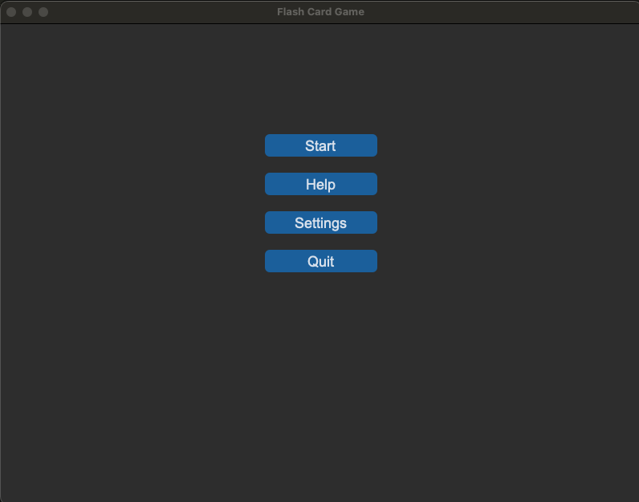
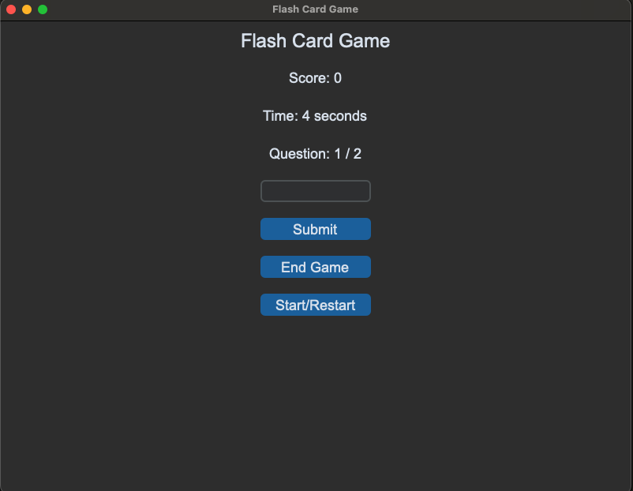
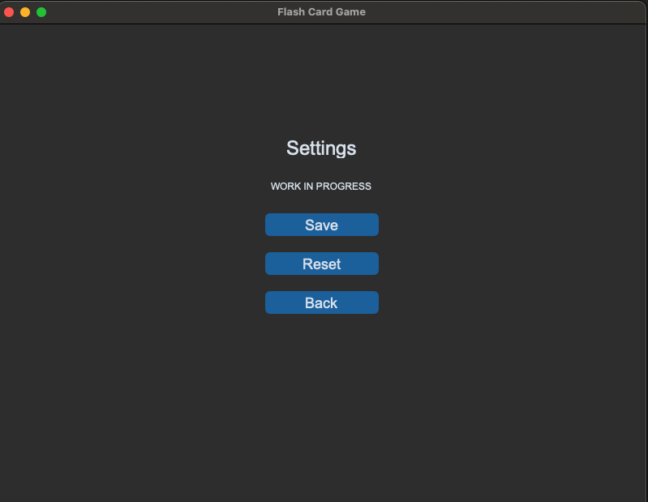

# Flash Card Game

This is a flash card game implemented in Python using the customtkinter library. The game generates random math questions for the user to answer.

## Installation

1. Clone the repository:

```sh
https://github.com/christopher-oyh/flash-card-game.git
```

2. Navigate to the project directory:

```sh
cd flash-card-game
```

3. Setup virtual environment:

```sh
python -m venv venv
```

4. Activate virtual environment:

```sh
source venv/bin/activate
```

5. Install the required dependencies:

```sh
pip install -r requirements.txt
```

## Usage

Run the game:

```sh
python3 flash_card_game.py
```

## Features

- Randomly generated math questions
- User input validation
- Score tracking
- Timer
- Custom GUI

## Screenshots

<!-- Screenshot from images -->

### Start Screen



### Game Screen



### Settings Screen



### Help Screen


## License

Distributed under the MIT License. See `LICENSE` for more information.
